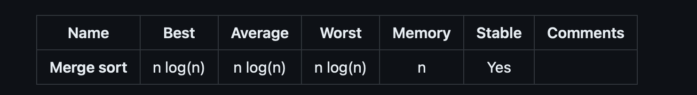

# Merge Sort

In computer science, merge sort (also commonly spelled mergesort) is an efficient, general-purpose, comparison-based sorting algorithm. Most implementations produce a stable sort, which means that the implementation preserves the input order of equal elements in the sorted output. Mergesort is a divide and conquer algorithm that was invented by John von Neumann in 1945.

An example of merge sort. First divide the list into the smallest unit (1 element), then compare each element with the adjacent list to sort and merge the two adjacent lists. Finally all the elements are sorted and merged.

A recursive merge sort algorithm used to sort an array of 7 integer values. These are the steps a human would take to emulate merge sort (top-down).

# Psuedo Code

- Break up the array in half, until length of sub array is equal to 1.
- Merge sub arrays with other sorted sub arrays until you get an array equal to the length of the original array.
- Return merged array.

# Time Complexity

logN is for splitting * N for merging 

# Space Complexity
- O(n)