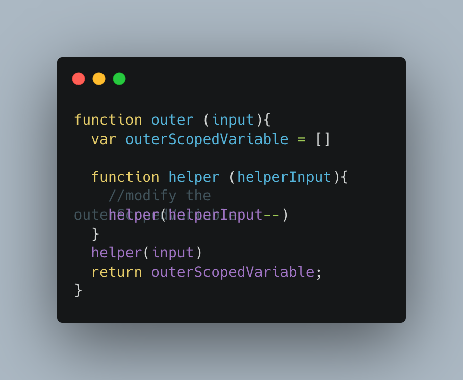

# Recursion

A process (or function ) that calls it self

JSON.parse /stringify, Object traversal are examples

# Essentials
Base case

 Recursion must have a base case, when the base case is met the recursion stops, other wise it will run forever and 
 will give maximum call stack error

# Change inputs

Same inputs might not reach the base case 

# Design Pattern for recursion
# Helper method recursion

# Pure Recursion