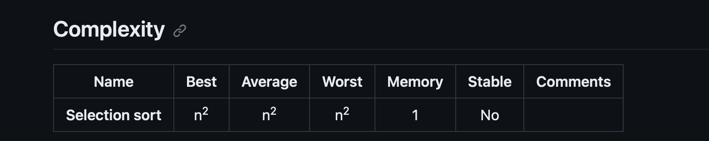

# Selection Sort

Similar to bubble sort, but place small values in sorted place, instead of large one

Selection sort is a sorting algorithm, specifically an in-place comparison sort. It has O(n2) time complexity, making it inefficient on large lists, and generally performs worse than the similar insertion sort. Selection sort is noted for its simplicity, and it has performance advantages over more complicated algorithms in certain situations, particularly where auxiliary memory is limited.

# Psuedo Code
- Store the first element as the smallest value.
- Compare this item to the next item in array until you find a smaller number.
- If smaller number is found, designate that smaller number to be the new minimum value and continue to the end of array.
- If the minimum is not the index you initially started with, swap.
- Repeat this with the next element until array is sorted.

# Time Complexity

